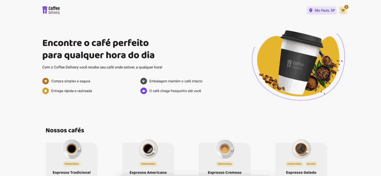

# Coffee Delivery

Um projeto desenvolvido com React para simular uma loja de cafés com funcionalidades de carrinho de compras, formulário de checkout e persistência de dados via `localStorage`.

## 🖼️ Visão Geral

O Coffee Delivery é uma aplicação de e-commerce fictícia onde o usuário pode:

- Navegar por uma lista de cafés
- Adicionar/remover cafés do carrinho
- Ajustar a quantidade de itens
- Preencher os dados de entrega
- Escolher a forma de pagamento
- Finalizar o pedido

## 🚀 Tecnologias Utilizadas

- **React**
- **TypeScript**
- **React Hook Form + Zod** (validação de formulários)
- **React Router DOM**
- **Context API** (gerenciamento de estado global do carrinho)
- **Phosphor Icons**
- **Tailwind CSS**

## 📦 Funcionalidades

- ✅ Adição e remoção de itens no carrinho
- ✅ Formulário completo de endereço com validação
- ✅ Escolha da forma de pagamento
- ✅ Cálculo do total + taxa de entrega
- ✅ Página de confirmação de pedido
- ✅ Armazenamento local temporário do pedido no `localStorage`
- ✅ Estilização responsiva com Tailwind

## 📁 Estrutura de Pastas

```
src/
├── components/         # Componentes reutilizáveis (ex: CoffeeCardCart)
├── context/            # CartContext (estado global do carrinho)
├── pages/              # Páginas principais: Home, Checkout, Success
├── schemas/            # Schemas de validação com Zod
├── routes/             # Definição das rotas com React Router
└── main.tsx            # Ponto de entrada da aplicação
```

## 🧪 Como Rodar o Projeto

### 1. Clone o repositório

```bash
git clone https://github.com/eduardossimas/coffee-delivery.git
cd coffee-delivery
```

### 2. Instale as dependências

```bash
npm install
# ou
yarn
```

### 3. Inicie o servidor de desenvolvimento

```bash
npm run dev
# ou
yarn dev
```

Acesse em: `http://localhost:5173`

## 📸 Demonstração



## 📝 Licença

Este projeto está sob a licença MIT. Veja o arquivo [LICENSE](./LICENSE) para mais detalhes.

---

Feito com 💙 por [Eduardo Simas](https://github.com/eduardossimas)
